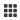
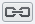

Create figures using OMERO.figure
=================================

OMERO.figure is a web-based tool for creating figures from Images in
OMERO. Image metadata can be used to facilitate figure creation.

Description
-----------

This guide covers:

- Opening images in OMERO.figure to create a new figure
- How to add additional images to an existing figure
- Arranging panels in the desired figure layout
- How to synchronize the rendering settings between panels
- How to add scalebars, labels and ROIs to panels
- How to save and export figures as PDF or TIFF

Setup
-----

-  Install the OMERO.figure web app as described at https://pypi.org/project/omero-figure/

Resources
---------

-  Sample images from the Image Data Resource (IDR) `idr0021 <https://idr.openmicroscopy.org/webclient/?show=project-51>`__.
   See `idr0021-data-prep.md <https://github.com/ome/training-scripts/blob/master/maintenance/preparation/idr0021-data-prep.md>`__
   for download and import instructions.

-  DV images from `siRNAi-HeLa <https://downloads.openmicroscopy.org/images/DV/siRNAi-HeLa/>`__.

-  SVS ‘big’ pathology images from `SVS <https://downloads.openmicroscopy.org/images/SVS/>`__.

Step-by-Step
------------

Using the sample images above, we will create a figure like this, but
you can use any multi-channel images.

.. image:: images/image0.png
   :align: center

#.  In the webclient, select 6 images from the **idr0021** Project.

#.  In the right-hand panel, click the *Open with...* button and choose *OMERO.figure*:

    .. image:: images/image1.png
       :scale: 75 %

#.  This will open these images in OMERO.figure in a new browser tab.

#.  Drag to arrange the Images approximately into two rows, select all (use Ctrl-A or drag to select) and click the *snap to grid* button |image2|\ at the top of the page.

#.  Select all Images and Zoom in around ~300%, using the Zoom slider in the right *Preview* tab.

#.  Go to the *Labels* tab, select all Images and add a Scalebar: Click the *Show* button, choose a length of 2 μm, click the *Label* checkbox and adjust the size of the Label to 12.

#.  Add labels: choose *Dataset Name* in the label input dropdown list, choose *color white* and *position=top-left*.

    .. image:: images/image3.png
       :scale: 75 %

#.  Click *Add* to create the new label.

#.  Add labels: choose *Key-Value Pairs* in the label input dropdown list, and in the following popup choose the Key which you want to add the value of from the dropdown menu.

    .. image:: images/image3a.png
       :scale: 75 %

#.  Click *OK* in that dialog to create the new label.

#.  Select one image. In the *Labels* tab, click the *Edit* button for ROIs.

#. If the image has ROIs in OMERO, click *Load ROIs.*

#.  Mouse over the list to show each ROI on the Image and click to add it to the Image.

#.  Click *OK* to close the dialog.

#.  Return to the webclient tab, select the **siRNAi-HeLa** Dataset.
    N.B.: You may wish to filter the images when selecting those to add to your figure, e.g. Filter by Rating.

#.  Select 3 images and in the right-hand panel click the link icon |image4|\ then copy the link.

#.  Return to the OMERO.figure tab, click *Add Image* button and paste the link into dialog. Click OK.

#.  Arrange the 3 images into a vertical column, select all and click *snap to grid* button.

#.  Copy the 3 images and paste (keyboard shortcut or *Edit > Copy/Paste*) 3 times to create 3 more columns.

#.  Select the panels in the first column and adjust the rendering settings: Turn only the first channel on and set the color to white.

#.  Repeat for the next 2 columns: 1 channel turned on for each column, adjusting the levels if desired, leaving the 4th column as **merged** with multiple channels on.

#.  Select all panels and zoom a little. Then select all the panels from one row and drag the image in the *Preview* tab to pan the selected images to the same point.

#.  Copy and paste the **merged** column again to create a 5th column. Zoom in to approx 500%.

#.  Select the *Labels* tab, select the **merged** and **zoomed** columns and click *Show* Scalebar button.

#.  Click the *Label* checkbox to add a label to the scalebar. Select only the zoomed-in panels and change the scalebar to 1 micron.

#.  Select the top-left panel and enter a label text in the *Add Labels* form. “Prometaphase” in the example above.

#.  Set the label size (14), position (left vertical) and color (black) and click *Add* to create a label.

#.  If we have Tags on the images, we can use these to create labels:

#.  Select the first column of panels and choose *Tags* from the label text-field drop-down options. Click Add.

#.  Select the first row of panels and create the labels in the *top* position using the *Channels* option to add Labels for active channels in each image.

#.  Edit the created labels located at the bottom of the *Info* tab to rename the green labels to **GFP-INCENP**.

#.  Select just the first **merged** Image and click the ROIs *Edit* button in the *Labels* tab.

#.  Draw arrows or other shapes on the Image, or load ROIs from OMERO. Click *OK* to close the dialog.

#.  Click *Copy* ROIs in the *Labels* tab, select the other panels in the same row and click *Paste* to add ROIs to these panels.

#.  To create a Rectangle ROI indicating the region of the zoomed-in image, select the zoomed-in image on the first row and click *Copy* of the cropped region at the bottom of the *Preview* tab.

#.  Now select the zoomed-out **‘merged’** panel, and paste this region as an ROI by clicking *Paste* under ROIs section of the *Labels* tab.

#.  Repeat for other rows of the figure. At this point we have created the figure in the screenshot above.

Saving and exporting figures
----------------------------

#.  Go to *File* > *Paper Setup...* and in the dialog that pops up choose *Pages: 2.* Click *OK*.

#.  Finally return to the webclient, select ‘Big’ images from the **svs** Dataset, copy the link to them and paste it into the *Add Image* dialog in OMERO.figure.

#.  Move the big images to the 2nd page.

#.  In the header, click on the *Save* button to save the Figure as “Figure 1”.

#.  The URL will update. You can bookmark this URL or share with collaborators to view your figure.

#.  To open other saved files, go *File > Open...*

#.  We can view figures from our collaborators here and filter by name or Owner.

#.  Choose a figure to Open. For example the **Aurora-B figure 2** from trainer-2.

#.  Select a panel and click on the *Webclient* link in the *Info* tab to show the image in the webclient.

#.  Back in OMERO.figure, go to *File > Open...* to choose the “Figure 1” file saved above.

#.  Click on *Export PDF* to export it as PDF.

#.  Download the PDF and open it. If opened in a suitable application e.g. Illustrator, the elements on the page will still be editable.

