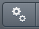

OMERO.figure scripting
======================

Description
-----------

We can use JavaScript in the browser console to script changes to a
figure. This is an experimental feature and not documented.
In this example, we will automatically add labels based on analysis results.

Setup
-----

-  Install the OMERO.figure web app as described at https://pypi.org/project/omero-figure/
-  Upload the script :download:`Split_View_Figure.py <../scripts/Split_View_Figure.py>` to the OMERO scripting service

Resources
---------

-  Any multi-channel images, e.g. from `siRNAi-HeLa <https://downloads.openmicroscopy.org/images/DV/siRNAi-HeLa/>`__
-  Any time-lapse images, e.g. `FRAP <https://downloads.openmicroscopy.org/images/DV/will/FRAP/>`__.

Figure creation in Python
-------------------------

OMERO.figure files are simply JSON data, stored in OMERO File Annotations with a specific
namespace of omero.web.figure.json. We can create these files using Python scripts, uploaded to
the OMERO.scripting service to make them available to all OMERO users.

The format of the JSON is described in the `Format <https://github.com/ome/omero-figure/blob/master/docs/figure_file_format.rst>`_ page.
We will use the example `Split_View_Figure.py <https://github.com/ome/omero-guide-figure/tree/master/scripts/Split_View_Figure.py>`_ script.

#. Select a few Images in the webclient.

#. Click on the Script button \ |script_icon|\  in the top-right of the webclient and choose the
   ``Split_View_Figure.py`` script (e.g. under Workshop Scripts).

#. Choose a value for `Row Labels` input. The default is label each row with the Image `Name`,
   but you can also choose `Tags` as in the example below.

#. Run the script. When complete, open the OMERO.figure app and File > Open.

#. Choose the most recent figure, called "Split View Figure".

    .. image:: images/script_split_view_figure.png
       :width: 515 px

Figure editing in JavaScript
----------------------------

#.  To see the data model for any current file in OMERO.figure, go to *File > Export as JSON...*.

#.  You will see that the ``panels`` list defines the panels and each panel has attributes. For example, a panel with a single white label might include the following attributes:

    ::

        "name": "image1.tiff",
        "labels":[{"text":"label text","size":12,"position":"topleft","color":"FFFFFF"}],
        "x": 200, "y", 200, "width": 100, "height": 100,
        ...many other attributes not shown...

#.  The ``figureModel`` variable is accessible in the `Console` of the browser `Developer Tools`. The easiest way to open
    the developer tools in most browsers is to open the context menu (right-click) anywhere on the page and choose `Inspect`.

#.  We can use ``figureModel.getSelected()`` to get selected panels and for each panel we can call ``p.set()`` to change an attribute.

#.  For example, to set the ``height`` of several panels to ``200``, we can select the panels in the figure UI and paste
    this code snippet in the `Console`:

    ::

        figureModel.getSelected().forEach(function(p){
            p.set('height', 200)
        });

#.  There are several JavaScript examples in the `scripts <https://github.com/ome/omero-guide-figure/tree/master/scripts>`_ folder.
    Many of these are quite simple and self-explanatory. Below are some more complex examples that require specific set-up steps.

Example 1: Labels from Map Annotations
~~~~~~~~~~~~~~~~~~~~~~~~~~~~~~~~~~~~~~

We will use the time-lapse images listed above to create a FRAP figure but you can use any time-lapse images.

    .. image:: images/script_frap_figure.png
       :width: 750 px
       :align: center

#.  We can use AJAX to load JSON data and we will use ``p.add_labels()`` to create labels.

#.  In this example we will load the FRAP intensities from the Map Annotations on these images.

#.  Select 2 FRAP images that have previously been analysed to create a ``Map Annotation`` with the namespace ``demo.simple_frap_data``.

    .. image:: images/script_map_ann_analysis.png
       :scale: 75 %

#.  Alternatively, you can add your own ``Map Annotation`` with each *Key* being a *T-index* (start at 0), and the *Value* will be a FRAP intensity (number).

    .. image:: images/script_map_ann_manual.png
       :scale: 75 %

#.  Create a Figure with 2 images.

#.  Copy and paste each image several times and increment T-index in the Preview panel to show multiple time-points per image.

#.  Open the browser console by *right-click > Inspect Element (Firefox)* or *right-click > Inspect (Chrome)* and click on the *Console* tab.

#.  Copy the code from `figure_frap_mapannotation_label.js <https://github.com/ome/omero-guide-figure/tree/master/scripts/figure_frap_mapannotation_label.js>`.

#.  Drag to select the FRAP movie images in the figure.

#.  Paste the code into the console. **Do not hit enter yet.**

#.  Inspect the code. It will iterate through each of the **selected** panels, an AJAX call is made to load the Map Annotations with the namespace that we created from FRAP values above.

#.  NB: If you manually created your own Map Annotation above, you can remove the line ``url += '&ns=' + ns;`` to avoid filtering by namespace.

#.  The FRAP values are a list of ``[key, value]`` pairs and we can get the value for the current T index of the panel with ``values[theT][1]`` and use this to create a label.

#.  Hit Enter to run the code on selected panels.

#.  The labels should be added. Note that you can undo and redo these changes in the UI as normal.

Example 2: Shapes heatmap from OMERO.table
~~~~~~~~~~~~~~~~~~~~~~~~~~~~~~~~~~~~~~~~~~

This example uses an OMERO.table linked to each Image to generate
a heatmap of colors applied to Shapes on the figure panel.
Selected panels need to have Shapes added from OMERO (in the ROIs dialog).
This means that each shape JSON will have an ``id`` that corresponds to a Shape in
OMERO.

The code at `figure_table_data_shapes.js <https://github.com/ome/omero-guide-figure/tree/master/scripts/figure_table_data_shapes.js>`_
uses the ID of each shape of the panel to query the most recent OMERO.table on the Image using the
endpoint: ``/webgateway/table/Image/{imageId}/query/?query=Shape-{shapeId}``, which returns
all table rows for that Shape ID. From the JSON returned, we find the column index for the
data we want, e.g. "Sphericity", and then get the value for that column.

Once the values for all Shapes on the panel are loaded, the code calculates the range and
generates a heatmap color for each value in that range. This is set as the color
on each Shape.

    .. image:: images/script_idr0079_heatmap.png
       :width: 690 px
